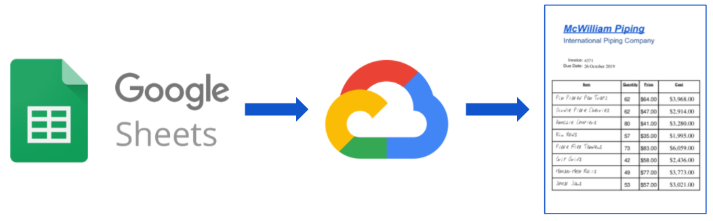
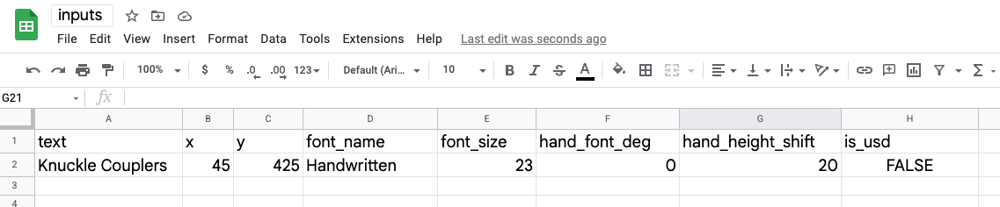
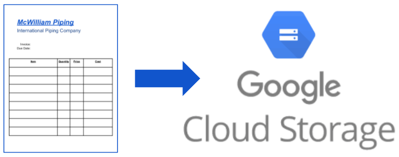

# PDF Generator 
  
  
A simple Google Cloud Run web service to generate data on a PDF.

This repo provides code and steps to build a Cloud Run.
The inputs:
1. Blank or template PDF file 
2. Spreadsheet or Database table with content to be written into PDF  
2and contents from spreadsheet or database. to be written on the PDF file and returns the PDF with the content.  An example use case is sending the service a PDF with a form or table and data for the form or table.  This service returns a PDF filled out with the provided data.
  
   
  
*****
# Installation  
Go to: https://console.cloud.google.com/ and open ***Cloud Shell Terminal***    
  
  
   
Run the following commands:

##### get code
> git clone https://github.com/will-hill/PDF_Generator.git
##### cd into repo directory
> cd PDF_Generator
##### build image locally
> docker build -t pdf-gen .
##### load image into Google Cloud
> gcloud builds submit --tag gcr.io/${GOOGLE_CLOUD_PROJECT}/pdf-gen
##### deploy as Cloud Run service
> gcloud run deploy pdf-gen --image=gcr.io/${GOOGLE_CLOUD_PROJECT}/pdf-gen \
> --platform=managed --region=us-central1 --no-allow-unauthenticated  --timeout=300 \
> --cpu=2 --memory=2G --concurrency=1 --ingress=all --port=8080
 
##### expected output
The output from the previous command will contain the URL to the Cloud Run service.  For example:

> Deploying container to Cloud Run service [pdf-gen] in project [singularity-beta] region [us-central1]  
✓ Deploying new service... Done.                                                             
  ✓ Creating Revision...  
  ✓ Routing traffic...  
Done.  
Service [pdf-gen] revision [pdf-gen-00001-fep] has been deployed and is serving 100 percent of traffic.  
Service URL: __https://pdf-gen-abc123xzy987-uc.a.run.app__  

   

****
# Simple Test
### In Cloud Shell terminal run this command:
> curl -H "Authorization: Bearer $(gcloud auth print-identity-token)" ${service_url}

### For example, using service url from above:

> curl -H "Authorization: Bearer $(gcloud auth print-identity-token)" https://pdf-gen-abc123xzy987-uc.a.run.app/hello
### expected output:
> hello there 

   

****
# Use Case #1 - Google Sheets input
  
If you are comfortable with SQL or Python, you can skip this use-case.  
In this use case we will use a blank or template PDF stored in GCS and a Google Sheets spreadsheet to generate a PDF.
### 1. Create Google Sheets Spreadsheet
##### a. Create Google Sheets Spreadsheet
Open of Google Drive and [create spreadsheet](https://docs.google.com/spreadsheets/create).
##### b. Create Header Row  
Make the first row equal to:     
###### text, x, y, font_name, font_size, hand_font_deg, hand_height_shift, is_usd

##### c. Create First Input Row  
Make the second row equal to:    
###### Knuckle Couplers, 45, 425, Handwritten, 23, 0, 20, False
  
##### d. Verify Spreadsheet
Your spreadsheet should looks something like this (text enlarged for clarity):   
   
  
  
   

****

### 2. Create Sheets-Linked BigQuery Table
  
      

Now we will create and synchronize a BigQuery table from the spreadsheet.

     

##### a. Create BigQuery Dataseet
'bq' command to create a dataset is:  
>_bq --location=${LOCATION mk -d ${DATASET_NAME}_  

For example, in Cloud Shell terminal run this command:

> bq --location=US mk -d pdf_gen

##### b. Create and Link BigQuery Table 
You will need the url of your spreadsheet.  It should look something like:  
https://docs.google.com/spreadsheets/d/123AbC456dEf789GHi098JKL765mnl123abc123abd9.  

The command format is:   
>_bk mk --external_table_definition=GOOGLE_SHEETS=$SHEETS_URL $DATASET.$NEW_TABLE_NAME_  

For example:
> bq mk --external_table_definition=GOOGLE_SHEETS=https://docs.google.com/spreadsheets/d/123AbC456dEf789GHi098JKL765mnl123abc123abd9  pdf_gen.inputs

  
   

****

### 3. Put Blank or Template PDF into Google Cloud Storage (GCS)  

    

This can be done manually in Google Cloud Console or with the following commands:
  
 
  
##### a. Create GCS Bucket

The command format is:  
> gsutil mb gs://${BUCKET_NAME}  

For example:   
> gsutil mb gs://${GOOGLE_CLOUD_PROJECT}-pdf  

 

##### b. Copy File to GCS Bucket
The format of this command is:  
> gsutil cp ${FILE} ${GCS_BUCKET}  

For example to copy the provided template PDF, using the following command:
> gsutil cp Empty_Table.pdf gs://${GOOGLE_CLOUD_PROJECT}-pdf/

  
   

****

### 4. Build the PDF  

Now we will call our Cloud Run service and generate the PDF file with data from the Google Sheets spreadsheet.

****
****
****
****  
****
****
****
****

##### create service account
> gcloud iam service-accounts create pdf-gen
> gcloud projects add-iam-policy-binding ${GOOGLE_CLOUD_PROJECT} --member="serviceAccount:pdf-gen@${GOOGLE_CLOUD_PROJECT}.iam.gserviceaccount.com" --role="roles/owner"
##### create credentials file
> gcloud iam service-accounts keys create credentials.json --iam-account=pdf-gen@${GOOGLE_CLOUD_PROJECT}.iam.gserviceaccount.com  
  
### 2. BigQuery input
##### create BigQuery dataseet
> bq --location=US mk -d pdf_gen
##### create BigQuery table linked to Google Sheets from above
> > bq mk --external_table_definition=GOOGLE_SHEETS= pdf_gen.inputs
### 3. Python input
  

### create BigQuery dataseet
> bq --location=US mk -d pdf_gen
### link table to Google Sheets spreadsheet
> bq mk --external_table_definition=GOOGLE_SHEETS= pdf_gen.inputs
schema

****
****
****
****  
****
****
****
****
****
****
****
****  
****
****
****
****

