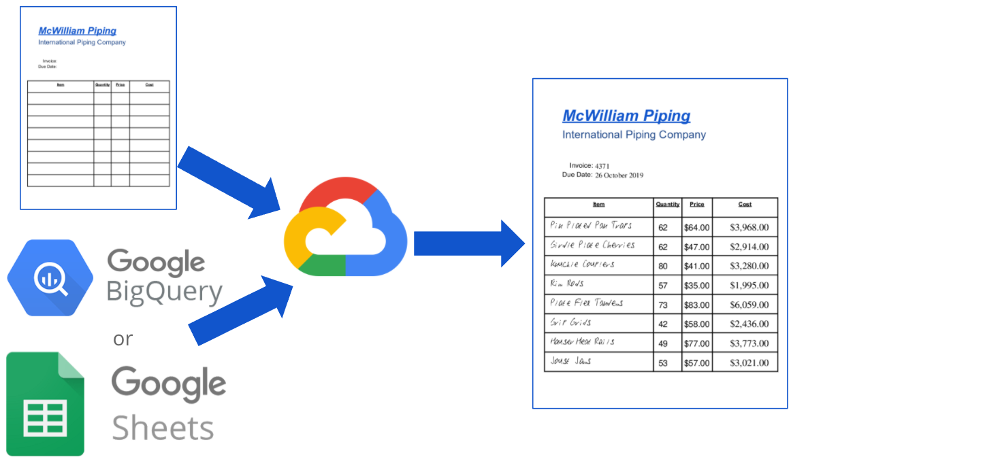
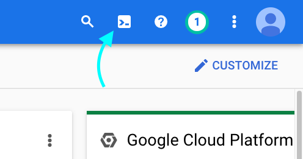

# PDF Generator 
  
  
A simple Google Cloud Run web service to generate data on a PDF.

This repo provides code and steps to build a Cloud Run.
The inputs:
1. Blank or template PDF file 
2. Spreadsheet or Database table with content to be written into PDF  
2and contents from spreadsheet or database. to be written on the PDF file and returns the PDF with the content.  An example use case is sending the service a PDF with a form or table and data for the form or table.  This service returns a PDF filled out with the provided data.

**Installation**  
Go to: https://console.cloud.google.com/ and open ***Cloud Shell Terminal***    
  
Run the following commands:

##### get code
> git clone https://github.com/will-hill/PDF_Generator.git
##### cd into repo directory
> cd PDF_Generator
##### build image locally
> docker build -t pdf-gen .
##### load image into Google Cloud
> gcloud builds submit --tag gcr.io/${GOOGLE_CLOUD_PROJECT}/pdf-gen
##### deploy as Cloud Run service
> gcloud run deploy pdf-gen --image=gcr.io/${GOOGLE_CLOUD_PROJECT}/pdf-gen \
> --platform=managed --region=us-central1 --no-allow-unauthenticated  --timeout=300 \
> --cpu=2 --memory=2G --concurrency=1 --ingress=all --port=8080
 
##### output
The output from the previous command will contain the URL to the Cloud Run service.  For example:

> Deploying container to Cloud Run service [pdf-gen] in project [singularity-beta] region [us-central1]  
✓ Deploying new service... Done.                                                             
  ✓ Creating Revision...  
  ✓ Routing traffic...  
Done.  
Service [pdf-gen] revision [pdf-gen-00001-fep] has been deployed and is serving 100 percent of traffic.  
Service URL: __https://pdf-gen-abc123xzy987-uc.a.run.app__  
 

